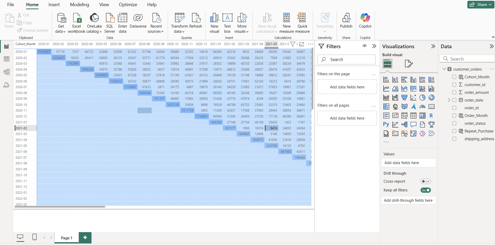
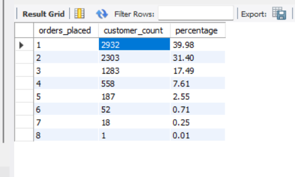
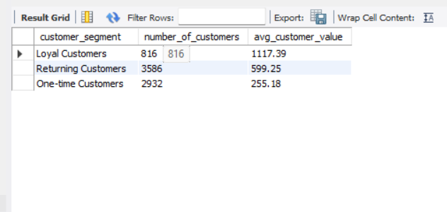
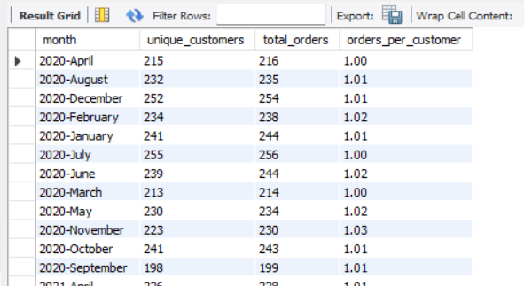
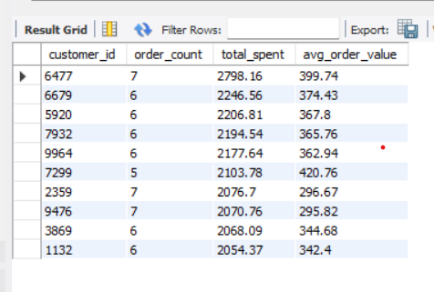
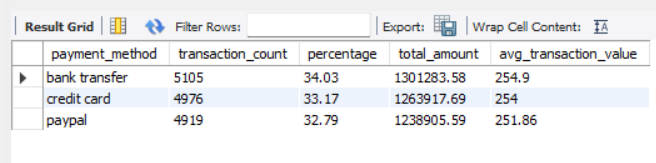
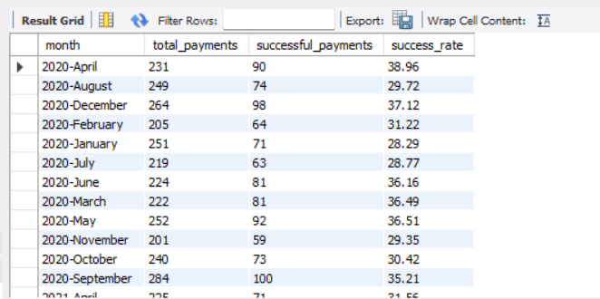
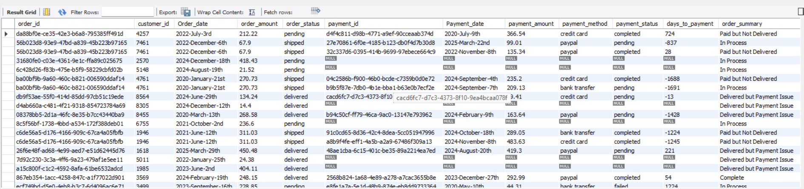
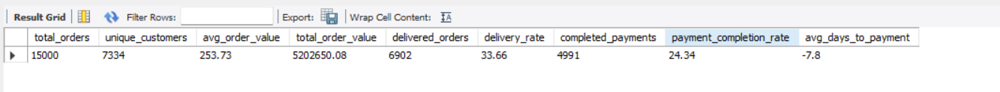

# Alt Mobility E-commerce Data Analysis

This repository contains SQL analysis of e-commerce data for Alt Mobility. The analysis focuses on understanding order patterns, customer behavior, payment transactions, and customer retention.

## 📌 Table of Contents
- [Alt Mobility E-commerce Data Analysis](#alt-mobility-e-commerce-data-analysis)
  - [📌 Table of Contents](#-table-of-contents)
  - [📖 Project Overview](#-project-overview)
  - [data Overview](#data-overview)
  - [Analysis Tasks](#analysis-tasks)
    - [1. Order and Sales Analysis](#1-order-and-sales-analysis)
    - [2. Customer Analysis](#2-customer-analysis)
    - [3. Payment Status Analysis](#3-payment-status-analysis)
    - [4. Order Details Report](#4-order-details-report)
    - [5. Customer Retention Analysis (Visualizations)](#5-customer-retention-analysis-visualizations)
    - [Customer Retention Heatmap](#customer-retention-heatmap)
  - [Key Findings](#key-findings)
    - [Order and Sales Insights](#order-and-sales-insights)
    - [Customer Behavior Patterns](#customer-behavior-patterns)
    - [Payment Performance](#payment-performance)
    - [Order Details Report](#order-details-report)
    - [Obervation of Customer Retention Analysis](#obervation-of-customer-retention-analysis)
  - [Recommendations](#recommendations)
  - [How to Use This Repository](#how-to-use-this-repository)
  - [Tools Used](#tools-used)
  - [Contact](#contact)

## 📖 Project Overview
This analysis provides **business intelligence insights** into Alt Mobility’s **e-commerce performance**, focusing on:
- **Order fulfillment efficiency**
- **Customer retention trends**
- **Payment success rates**
- **Sales growth patterns**

---

## data Overview

This analysis is based on two primary datasets stored in the `data/` folder:

1. **customer_orders.csv**: Contains order information
   - order_id, customer_id, order_date, order_amount, shipping_address, order_status

2. **payments.csv**: Contains payment transaction details
   - payment_id, order_id, payment_date, payment_amount, payment_method, payment_status

## Analysis Tasks

### 1. Order and Sales Analysis

The SQL queries in [`order_sales_analysis.sql`](sql/order_sales_analysis.sql) analyze order fulfillment and revenue trends by examining:

- Distribution of orders by status
- Monthly sales trends
- Revenue by order status
- Year-over-year growth patterns

**Key metrics tracked:**
- Order count and distribution by status
- Revenue trends over time
- Average order value
- Fulfillment rate

### 2. Customer Analysis

The [`customer_analysis.sql`](sql/customer_analysis.sql) file contains queries that explore customer ordering behavior to identify:

- Order frequency patterns
- Customer segmentation
- Monthly unique customers and order rates
- High-value customers

**Customer segmentation approach:**
- One-time customers (1 order)
- Returning customers (2-3 orders)
- Loyal customers (>3 orders)

### 3. Payment Status Analysis

The [`payment_analysis.sql`](sql/payment_analysis.sql) queries investigate payment transactions to reveal:

- Payment status distribution
- Payment method effectiveness
- Success rates by payment method
- Monthly payment success trends

**Key payment metrics:**
- Transaction count by status
- Success rate by payment method
- Month-over-month payment processing efficiency

### 4. Order Details Report

The [`order_details_report.sql`](sql/order_details_report.sql) file creates a comprehensive view that joins order and payment data to provide:

- Complete order lifecycle information
- Payment-to-order relationships
- Order fulfillment and payment status alignment
- Order processing time metrics

### 5. Customer Retention Analysis (Visualizations)

The [`visualizations`](visualizations/) folder contains charts and graphs that visualize the analysis results, with a particular focus on the cohort-based customer retention.

### Customer Retention Heatmap

The retention heatmap displays:
- **X-axis**: Months since first purchase
- **Y-axis**: Cohort (month of first purchase)
- **Cell color intensity**: Retention percentage

This visualization allows us to see:
1. How well each cohort retains customers over time
2. Which cohorts show stronger retention
3. At what point customer retention typically drops

## Key Findings

### Order and Sales Insights
- **Order Status Distribution**
  
  
- **Sales by Order Status**  
  
  - **Order Status Distribution**  
  
- **Year-over-Year Growth**  
  

### Customer Behavior Patterns

- **Customer Order Frequency**  
  
- **Customer Segmentation**  
  
- **Customer Purchase Timeline**  
  
- **Top Customers by Spend**  
  

### Payment Performance

- **Payment Status Overview**  
  
- **Payment Method Analysis**  
  
- **Payment Success Rate by Method**  
  
- **Monthly Payment Success Trend**  
  

### Order Details Report
- **Comprehensive Order Details Report**  
  
- **Order Summary Metrics**  
  

### Obervation of Customer Retention Analysis
1. How well each cohort retains customers over time
2. Which cohorts show stronger retention
3. At what point customer retention typically drops
4.  Analyze high-retention cohorts to understand what keeps them engaged.
5.  Identify key drop-off points and address common pain points

## Recommendations

Based on your Customer Retention Analysis Dashboard, here are some recommendations to improve customer engagement, retention, and sales for Alt Mobility:

1. Enhance Customer Retention Strategies
- If you notice retention drops after the first month, implement post-purchase engagement strategies such as:- Personalized email campaigns with discounts on second purchases.
- Loyalty programs rewarding repeat purchases.
- Surveys to understand customer pain points and improve service.

2. Identify and Target High-Retention Cohorts
- If certain cohorts retain better, analyze why:- Were they offered promotions?
- Did they order high-value items?
- Were their orders processed faster?
- Apply successful marketing strategies from high-retention cohorts to lower-retention ones.

3. Optimize Order Processing and Delivery
- If pending or canceled orders are common, streamline fulfillment:- Improve inventory management.
- Ensure faster shipping times to improve customer satisfaction.

4. Address Payment Failures
- If payment issues are detected:- Investigate failure reasons (method-related issues, declined transactions).
- Offer diverse payment options (UPI, wallets, buy-now-pay-later options).
- Improve checkout experience to reduce friction.

## How to Use This Repository

1. Clone the repository
2. Import the SQL scripts into your database management tool
3. Run the queries against your database with the datasets loaded
4. Review the visualizations in the visualizations folder

## Tools Used

- MySQL for data analysis
- Power BI  for visualization
- Git/GitHub for version control

## Contact

For questions regarding this analysis, please contact 